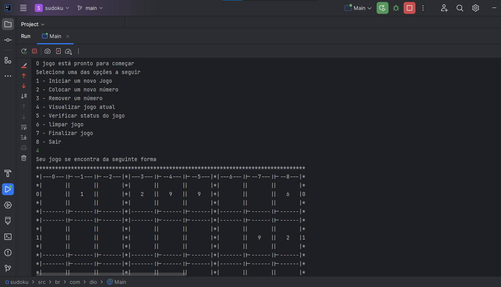
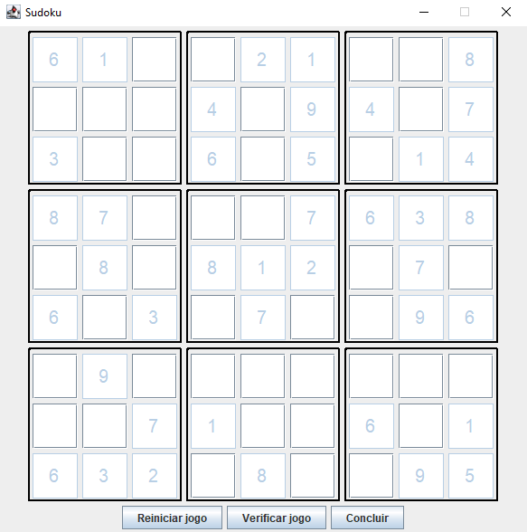

Understanding your question: doing
Gathering relevant information: doing
# README

## Sudoku em Java - Projeto de Estudo

### Contexto do Projeto
Este projeto é uma implementação do jogo Sudoku utilizando a linguagem de programação Java. O objetivo principal é fornecer um ambiente interativo para jogar Sudoku, tanto via linha de comando quanto através de uma interface gráfica (GUI). Este projeto foi desenvolvido como parte dos cursos de fundamentos de Java da Digital Innovation One.

### Estrutura do Projeto
O projeto segue uma estrutura modular e organizada para facilitar a manutenção e expansão do código. Abaixo está a árvore de diretórios do projeto:

```
src/
├── br/
│   └── com/
│       └── dio/
│           ├── Main.java
│           ├── UIMain.java
│           ├── model/
│           │   ├── Board.java
│           │   ├── GameStatusEnum.java
│           │   └── Space.java
│           ├── service/
│           │   ├── BoardService.java
│           │   ├── EventEnum.java
│           │   ├── EventListener.java
│           │   └── NotifierService.java
│           ├── ui/
│           │   └── custom/
│           │       ├── button/
│           │       │   ├── CheckGameStatusButton.java
│           │       │   ├── FinishGameButton.java
│           │       │   └── ResetButton.java
│           │       ├── frame/
│           │       │   └── MainFrame.java
│           │       ├── input/
│           │       │   ├── NumberText.java
│           │       │   └── NumberTextLimit.java
│           │       ├── panel/
│           │       │   └── MainPanel.java
│           │       │   └── SudokuSector.java
│           │       └── screen/
│           │           └── MainScreen.java
│           └── util/
│               └── BoardTemplate.java
```


### Design Patterns Utilizados
1. **Singleton Pattern**:
    - Utilizado na classe `BoardTemplate` para garantir que apenas uma instância seja criada.

2. **Observer Pattern**:
    - Implementado através das classes `NotifierService` e `EventListener`. Permite que diferentes componentes sejam notificados sobre eventos específicos sem estarem diretamente acoplados.

3. **Factory Method Pattern**:
    - Embora não seja explicitamente nomeado, o método `initBoard` no `BoardService` pode ser considerado uma implementação desse padrão, pois cria objetos `Space` com base nas configurações iniciais do tabuleiro.

4. **Strategy Pattern**:
    - A lógica de verificação de status do jogo (`gameIsFinished`, `hasErrors`) pode ser vista como uma estratégia que pode ser facilmente expandida ou modificada conforme necessário.

### Engenharia de Software
- **SOLID Principles**:
    - **Single Responsibility Principle (SRP)**: Cada classe tem uma única responsabilidade. Por exemplo, `BoardService` cuida da lógica de inicialização e validação do tabuleiro, enquanto `MainScreen` gerencia a construção da interface gráfica.
    - **Open/Closed Principle (OCP)**: As classes são abertas para extensão mas fechadas para modificação. Novas funcionalidades podem ser adicionadas sem alterar o código existente.
    - **Liskov Substitution Principle (LSP)**: Classes derivadas podem substituir suas classes base sem afetar a integridade do programa.
    - **Interface Segregation Principle (ISP)**: Interfaces específicas são preferíveis a interfaces genéricas. Isso é aplicado indiretamente através do uso de interfaces funcionais e métodos de callback.
    - **Dependency Inversion Principle (DIP)**: Dependências são injetadas através do construtor, minimizando acoplamento direto entre classes.

- **Test Driven Development (TDD)**:
    - Embora não haja evidência direta de testes unitários neste código, a estrutura modular facilita a adição de testes automatizados no futuro.

### Funcionalidades Principais
1. **Iniciar um novo jogo**: Gera um tabuleiro Sudoku aleatório ou baseado em configurações fornecidas.
2. **Inserir/Remover números**: Permite ao jogador inserir ou remover números no tabuleiro.
3. **Verificar status do jogo**: Mostra o status atual do jogo e verifica se há erros.
4. **Finalizar jogo**: Verifica se o jogo foi concluído corretamente e exibe uma mensagem de vitória.
5. **Reiniciar jogo**: Limpa todo o progresso e reinicia o jogo.

### Como Executar
1. **Via Linha de Comando**:
    - Execute o arquivo `Main.java`.
    - Siga as instruções no menu para jogar.



2. **Via Interface Gráfica**:
    - Execute o arquivo `UIMain.java`.
    - Interaja com os botões e campos de texto para jogar.



### Pré-requisitos
- JDK 21 ou superior
- IDE compatível com Java (recomendado IntelliJ IDEA ou Eclipse)

### Contribuição
Contribuições são bem-vindas! Se você encontrar bugs ou tiver sugestões de melhorias, por favor abra uma issue ou envie um pull request.

---

Este README fornece uma visão geral detalhada do projeto Sudoku em Java, incluindo sua estrutura, padrões de design utilizados e principais funcionalidades. Esperamos que isso ajude a compreender e expandir o projeto conforme necessário.